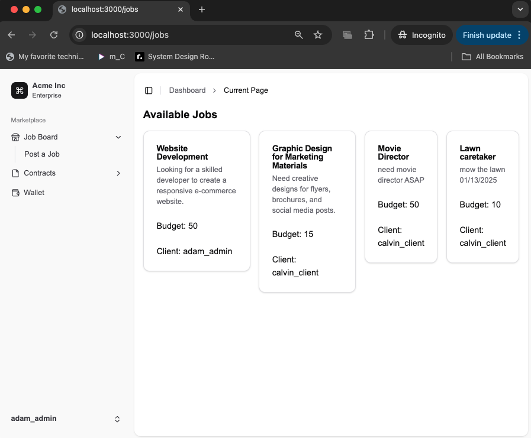

# Decentralized Freelance Marketplace

## Setting up

1. Install the [FireFly CLI here](https://github.com/hyperledger/firefly-cli?tab=readme-ov-file#install-the-cli)
2. Create a FireFly stack by running:
   ```bash
   ff init devChallenge ethereum --block-period 2
   ```
   or if installed using homebrew
   ```bash
   firefly init devChallenge ethereum --block-period 2
   ```
   make sure to create 3 nodes
3. Start the FireFly stack by running:
   ```bash
   firefly start devChallenge
   ```

## Getting this repo up and running

This repo has three directories in it:

- `solidity`: Two example solidity contracts that can be compiled, tested, and deployed with Hardhat. [Go to the Readme](./solidity/)
- `backend`: A very simple TypeScript Node.js app that uses the FireFly SDK to interact with a custom smart contract. [Go to the Readme](./backen/)
- `frontend`: A TypeScript Next.js bootstrapped with tailwindcss that calls the API in the backend. [Go to the Readme](./frontend/)

You will need to first deploy the example smart contracts with Hardhat to FireFly. Once the backend/frontend are started, the frontend will interact with the blockchain.



